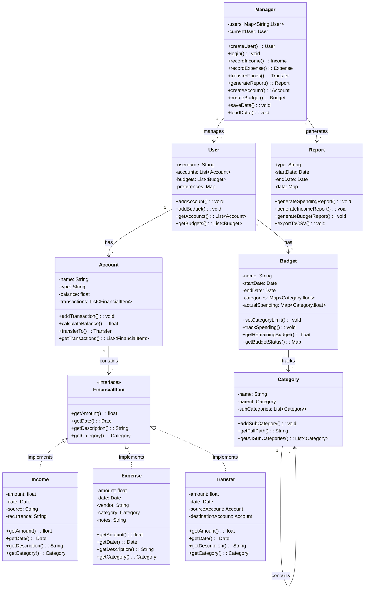

# Jack's Budget Tool - Personal Finance Manager

**CS121 Project by Jack Wagner**

## Purpose

This project demonstrates mastery of CS121 concepts including:
- Object-Oriented programming principles
- Implementation of various data types
- Effective use of data structures
- Real-world problem solving

## Overview

Jack's Budget Tool is a personal finance management application that helps users:
- Track income and expenses
- Create and manage budgets
- Categorize transactions  
- Generate financial reports
- Set and monitor savings goals

The system uses OOP principles to create a modular, extensible application focused on user needs.

## Class Structure

### Key Components

#### Financial Item Interface
Defines common properties and methods for all financial items:
- Get amount, date, description, and category
- Implemented by all transaction types

#### Transaction Classes
Three classes implementing FinancialItem:
- **Income**: Tracks money coming in (source, amount, date, recurrence)
- **Expense**: Tracks money going out (vendor, amount, date, category, notes)
- **Transfer**: Tracks money between accounts (source/destination accounts, amount, date)

#### Account Class
Represents financial accounts with:
- Properties: name, type, balance, transactions
- Methods: add transactions, calculate balance, transfer funds

#### Budget Class
Manages spending categories with:
- Category allocations
- Tracking against budgeted amounts
- Remaining funds calculation

#### Category Class
Creates hierarchical spending categories:
- Parent-child relationships (e.g., "Food" → "Groceries", "Dining Out")
- Tree-like data structure

#### Report Class
Generates financial reports:
- Spending by category
- Income vs expenses
- Budget adherence

#### User Class
Stores user information and preferences:
- Accounts
- Budgets
- Report settings

#### Manager Class
Main control class that:
- Manages user data
- Coordinates accounts and budgets
- Handles data persistence
- Provides user interface

## Technical Details

### Data Storage
- Object serialization for data persistence
- Session persistence

### Data Structures
- ArrayLists: Transactions, accounts, budgets
- Linked Lists: Transaction history
- Tree Structures: Hierarchical categories
- Maps: Account/category lookups

### OOP Principles
- **Inheritance**: Transaction classes implement FinancialItem
- **Encapsulation**: Private data members with getters/setters
- **Polymorphism**: Interface methods implemented differently per type
- **Abstraction**: Interfaces for financial concepts
- **Aggregation**: Manager holds Account and Budget collections
- **Composition**: Account contains Transaction collections

## Use Cases

1. **Budget Creation**: Set up spending categories and allocate monthly amounts
2. **Transaction Recording**: Log income/expenses with categories
3. **Financial Analysis**: Generate reports on spending patterns
4. **Goal Setting**: Create savings goals with targets and timeframes
5. **Account Management**: Manage multiple accounts and transfers

## Technology

- **Language**: Java
- **Interface**: Command-line (initial), optional GUI planned
- **Dependencies**: None - runs on any JRE-equipped computer
- **Features**: Collections framework, serialization capabilities

## UML Diagram

## Project Milestones

1. UML diagram and class structure approval ✓
2. Core classes implementation (FinancialItem interface, Transaction classes)
3. Account and Budget class implementation
4. Basic CLI and transaction entry functionality
5. Category management and budget tracking
6. Reporting functionality
7. Data persistence (save/load)
8. Testing and refinement
9. Optional: Basic GUI implementation
10. Documentation and project submission
